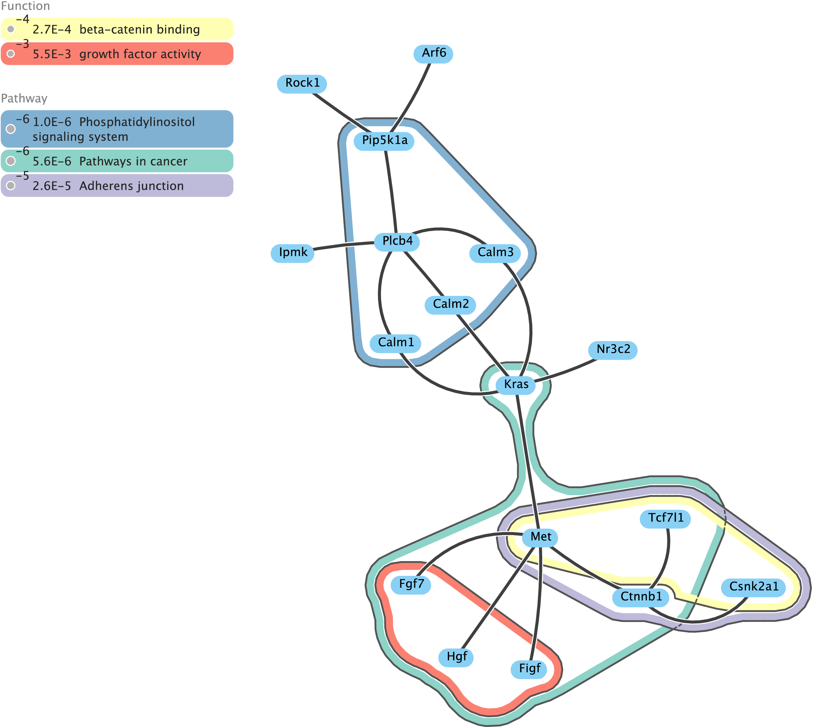

RefNode
=======

eXamine is a Cytoscape app for a set-oriented visual analysis approach for annotated modules that displays set membership as contours on top of a node-link layout.

Compilation instruction
-----------------------

Apache Maven is required to compile the code via:

    mvn install

eXamine
=======

eXamine is a Cytoscape app for a set-oriented visual analysis approach for annotated modules that displays set membership as contours on top of a node-link layout.

